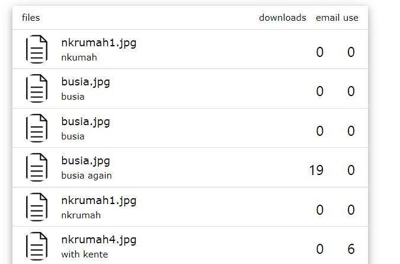

## Project Title: File Server

## Background
Lizzy runs a business that distributes documents in the likes of wedding cards, admission forms etc. on behalf of various businesses to different users. All have been moving well, but she desires to scale her business. After doing research, she finds that having a digital platform where these can be easily accessed and downloaded remotely is a good solution to the scaling challenge she currently faces. She has found you after your relatives in her network defended you to be the right person for the job.

## Strategy
This project uses:

 1. Frontend: `react` and  `react-router-dom` 
 2. Backend: Node.js
 3. Database: Firestore

### ER Diagram

## Customer Requirements
 ### users should be able to:
1. Signup & log in with an email and password with account verification.
 + There should be a reset password feature to recover lost passwords

2. See a feed page that contains a list of files that can be downloaded.

3. Search the file server

4. Send a file to an email through the platform

### Admin
1. Should be able to upload files with a title and description

2. Should be able to see the number of downloads and number of emails sent for each file

